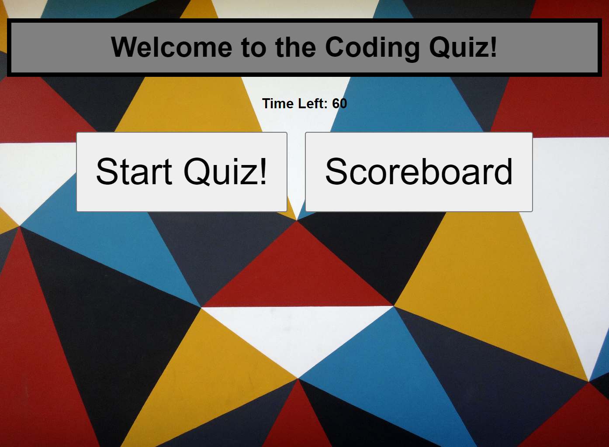

This application was created as a fun way to test one's knowledge of javascript and show off a little of what I have learned throughout my time in the coding bootcamp. In this quiz, questions will be presented, and once the correct answer is chosen, the next question will appear. After all questions are answered, you may save your initials and be added to the leaderboard that will keep track of who had the highest score.

Here is the link to the deployed application: https://msteven5.github.io/Timed-Coding-Quiz/ as well as a screenshot of the completed layout you can expect to see on the initial page of the website: 

The one photo used in this application was provided by Unsplash.com and I have them credited here:
//Photo by <a href="https://unsplash.com/@gpthree?utm_content=creditCopyText&utm_medium=referral&utm_source=unsplash">George Pagan III</a> on <a href="https://unsplash.com/photos/multicolored-wallpaper-WwCTFNpZx8g?utm_content=creditCopyText&utm_medium=referral&utm_source=unsplash">Unsplash</a>

All coding in the HTML, CSS, JavaScript files was done by myself, utilizing resources given to me such as the school ai teaching assistant chat and information uncovered through websites meant to provide additional information.